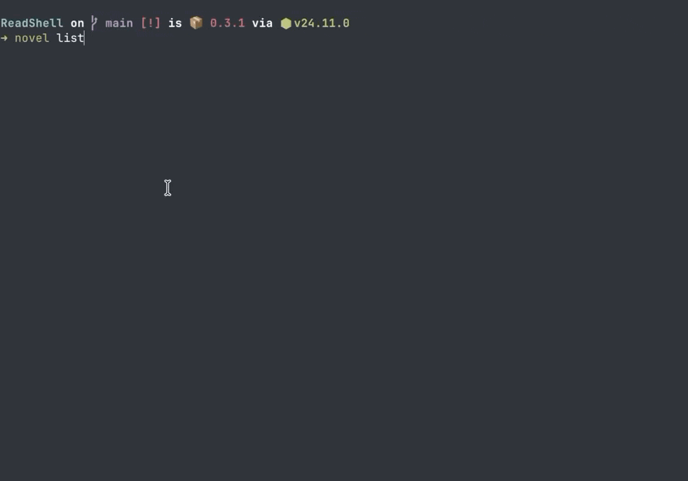

[English](README.md) | [中文](README_zh.md)

<div align="center">

# ReadShell

**终端里已经有了一切。现在它有了一个书架。**

[](https://www.npmjs.com/package/readshell)
[](https://www.npmjs.com/package/readshell)
[](https://www.gnu.org/licenses/agpl-3.0)
[](https://nodejs.org)

*为不离开终端的开发者设计的低打断轻阅读工具*




---

## 问题是这样的

等编译、等部署、等 CI 跑完——你有 5 分钟。

你拿起手机。40 分钟后，你还在刷。

ReadShell 就是为这段空隙设计的——一个活在工作流里、而不是工作流之外的阅读入口。
```bash
novel resume
```

一条命令，回到上次读到的地方。准备好了，关掉，继续写代码。

---

## 功能

**📖 `novel resume` — 零摩擦续读**
最重要的命令。精确到字节地恢复你上次的阅读位置。

**🥷 老板键 (`b` / `Esc`) — 一键伪装**
按下去，阅读器瞬间变成一段看起来正在运行的终端日志。同事路过，稳如泰山。

**⏱ 阅读剩余时间**
基于你实际阅读速度实时演算。让你知道这段空隙够不够看完下一章。

**🔖 书签 (`m`)**
随手标记当前页面。之后在章节导航器（`c`）里随时找回。

**📚 批量导入**
`novel import ~/books/` — 递归扫描整个文件夹，`.txt` 和 `.epub` 一次全进。

**🌐 中英双语**
原生支持中文和英文界面。

---

## 快速开始
```bash
npm install -g readshell
```
```bash
# 导入书籍
novel import ~/books/

# 回到上次读的地方
novel resume

# 或者指定打开某本书
novel open <book-id>

# 查看书架
novel list
```

### 阅读器快捷键

| 快捷键 | 功能 |
|---|---|
| `空格` / `j` / `↓` | 下一页 / 向下滚动 |
| `k` / `↑` | 上一页 / 向上滚动 |
| `c` | 章节列表与书签 |
| `Tab` | 切换目录 / 书签 |
| `m` | 添加书签 |
| `b` / `Esc` | **老板键** — 伪装并存档 |
| `q` | 退出并保存 |
| `?` | 帮助 |

### 配置
```bash
novel lang zh                       # 切换语言 (zh / en)
novel config line-spacing 1         # 行间距
novel config reading-mode scroll    # 阅读模式：scroll / page
novel update                        # 更新到最新版本
```

---

## 为什么在终端里做阅读器？

终端已经是你的主场。它专注、纯粹、天然屏蔽干扰。

ReadShell 不要求你切换上下文。它安静地待在你的工作流里——对同事不可见，无需账号，无需网络，没有推送，没有算法，没有人知道你在这里。

你的所有阅读记录都以 SQLite 文件的形式存在本地硬盘上，从不上传，完全属于你。

---

## 技术栈

- **TypeScript** + **Node.js** ≥ 18
- **Ink** — React 范式的终端 UI 框架
- **SQLite** (`better-sqlite3`) — 本地优先，零依赖存储
- **Vitest** — 测试框架

## 项目结构
```
src/
├── cli/        # 命令层
├── ui/         # TUI 组件（Ink）
├── services/   # 业务逻辑
├── parsers/    # txt / epub 解析
├── db/         # SQLite 层
├── config/     # 配置管理
└── utils/
```

---

## 参与贡献

欢迎提 Issue、分享想法、发起 PR。

如果 ReadShell 进了你的日常工作流，点一个 ⭐ 能让更多开发者发现它。

---

## 许可证

[AGPL-3.0](LICENSE)