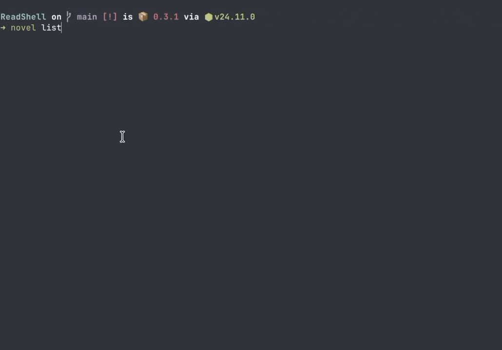
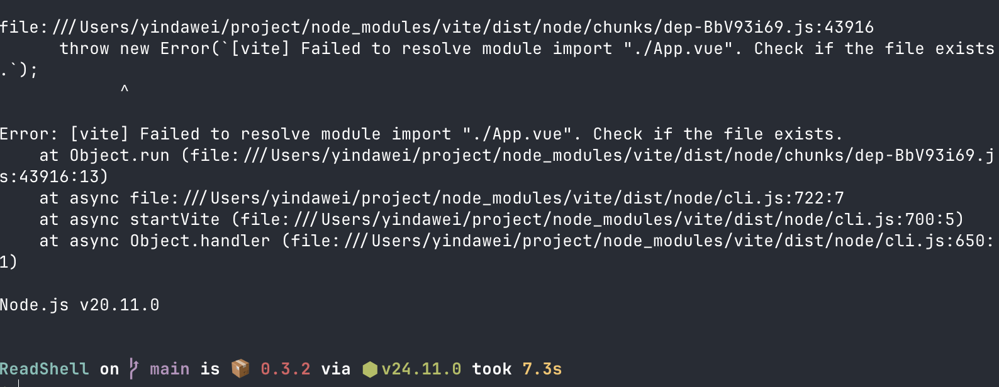

[English](README.md) | [中文](README_zh.md)

<div align="center">

# ReadShell

**终端里已经有了一切。现在它有了一个书架。**

[](https://www.npmjs.com/package/readshell)
[](https://www.npmjs.com/package/readshell)
[](LICENSE)
[](https://nodejs.org)

*为不离开终端的开发者设计的低打断轻阅读工具。完全免费开源——没有账号、没有服务器、没有付费墙。*



</div>

---

## 问题是这样的

等编译、等部署、等 CI 跑完——你有 5 分钟。

你拿起手机。40 分钟后，你还在刷。

ReadShell 就是为这段空隙设计的——一个活在工作流里、而不是工作流之外的阅读入口。
```bash
novel resume
```

一条命令，回到上次读到的地方。准备好了，关掉，继续写代码。

---

## 功能

**📖 `novel resume` — 零摩擦续读**
最重要的命令。精确到字节地恢复你上次的阅读位置。

**🥷 老板键 (`b` / `Esc`) — 一键伪装**
按下去，阅读器瞬间变成一段看起来正在运行的终端报错日志（nodejs / python / java / c / go 五种伪装）。

*老板键会彻底清除终端滚动历史并显示模拟报错。安全后执行 `novel resume` 即可一键回到阅读现场。*

**🔄 文件夹同步 — 多设备，无服务器**
把同步目录指向 iCloud Drive、Dropbox、OneDrive、坚果云或 Syncthing 里的任意文件夹即可。进度、书签（含删除）和阅读统计会在打开/退出阅读器时自动合并。数据永远不会上传到任何 ReadShell 服务器——根本没有服务器。

**📊 `novel stats` — GitHub 风格热力图**
一眼看尽近一年的阅读记录，外加阅读天数、总时长、书籍数和连续天数——跨设备聚合。

**🔖 书签 (`m`) + 免费导出**
读到一半标记一段文字，用章节导航 (`c`) 随时跳回，`novel bookmarks export --format md|json` 导出全部书签。

**📚 批量导入**
`novel import ~/books/` — 递归导入整个目录的 `.txt`、`.epub`、`.md` 文件。

**🌐 中英双语**
`novel lang zh|en` 切换界面语言。

---

## 快速开始
```bash
npm install -g readshell
```
```bash
# 导入书籍
novel import ~/books/

# 回到上次的位置
novel resume

# 或打开指定书籍
novel open <book-id>

# 浏览书架
novel list
```

### 阅读器按键

| 按键 | 作用 |
|---|---|
| `Space` / `j` / `↓` / `f` | 下一页 / 向下滚动 |
| `k` / `↑` | 上一页 / 向上滚动 |
| `g` / `G` | 首页 / 末页 |
| `c` | 章节列表与书签 |
| `Tab` | 切换章节 / 书签 |
| `m` | 加书签 |
| `b` / `Esc` | **老板键** — 伪装并保存 |
| `q` | 退出并保存 |
| `?` | 帮助 |

### 命令
```bash
novel import <path>                    # 文件或目录（txt / epub / md）
novel list                             # 书架
novel open <id|书名>                   # 打开书籍
novel resume                           # 恢复上次阅读
novel remove <id|书名>                 # 从书架移除
novel stats                            # 阅读热力图与连续天数
novel bookmarks export [--format json|md] [--out file]
novel sync --dir <路径> [--with-books] # 设置同步文件夹并同步
novel sync                             # 用已保存的目录同步
novel sync --off                       # 关闭同步
novel lang zh|en                       # 界面语言
novel config <key> <value>             # language | line-spacing | reading-mode | boss-key-lang
novel update                           # 更新到最新版
```

---

## 文件夹同步

ReadShell 通过一个普通文件夹同步——没有账号，没有服务器。每台设备把自己的快照写入 `<同步目录>/readshell-sync/devices/<设备ID>.json`，再合并其他设备的文件（进度 last-write-wins、书签墓碑、会话并集）。

选一个你的同步工具已经在盯着的目录：

```bash
# iCloud Drive (macOS)
novel sync --dir "$HOME/Library/Mobile Documents/com~apple~CloudDocs/ReadShell"

# Dropbox
novel sync --dir ~/Dropbox/ReadShell

# 坚果云 / OneDrive / Syncthing — 同理，任何被同步的文件夹都行
novel sync --dir ~/Nutstore/ReadShell
```

加上 `--with-books` 会把书源文件一并拷进同步目录——其他设备会自动导入本地没有的书。不加则只同步进度/书签/统计（书籍按文件 hash 匹配）。

打开阅读器时自动拉取、退出时自动推送+拉取，静默执行且最多等待约 2 秒。`novel sync --off` 关闭同步。

---

## 从 readshell-pro 迁移

```bash
npm uninstall -g readshell-pro && npm install -g readshell
```

书架、进度、书签全部保留——数据目录不变。旧的云账号配置会在首次运行时自动清理。

---

## 为什么是终端？

终端本来就是你待的地方。它专注、纯文本、天然抗干扰。

ReadShell 不要求你切换上下文。它安静地待在你的工作流里——同事看不见，零安装摩擦，没有账号，没有云，没有噪音。

你的阅读历史完整地保存在本机的一个 SQLite 文件里（以及你自己选择的同步文件夹）。除此之外，什么都不离开你的磁盘。

---

## 技术栈

- **TypeScript** + **Node.js** ≥ 20
- **Ink** — React 范式的 TUI 框架
- **SQLite** (`better-sqlite3`) — 本地优先、零依赖存储
- **Vitest** — 测试

## 项目结构
```
src/
├── cli/        # 命令层
├── ui/         # TUI 组件 (Ink)
├── services/   # 业务逻辑（含文件夹同步、统计）
├── parsers/    # txt / epub / md 解析器
├── db/         # SQLite 层
├── config/     # 配置管理
└── utils/
```

---

## 参与贡献

欢迎 Issue、想法和 PR——见 [CONTRIBUTING](docs/CONTRIBUTING.md)。
如果 ReadShell 融入了你的工作流，一颗 ⭐ 能让更多人发现它。

## 赞助

如果 ReadShell 帮你省下了时间，可以考虑支持开发：https://readshell.com/sponsor

---

## 许可证

[MIT](LICENSE)
